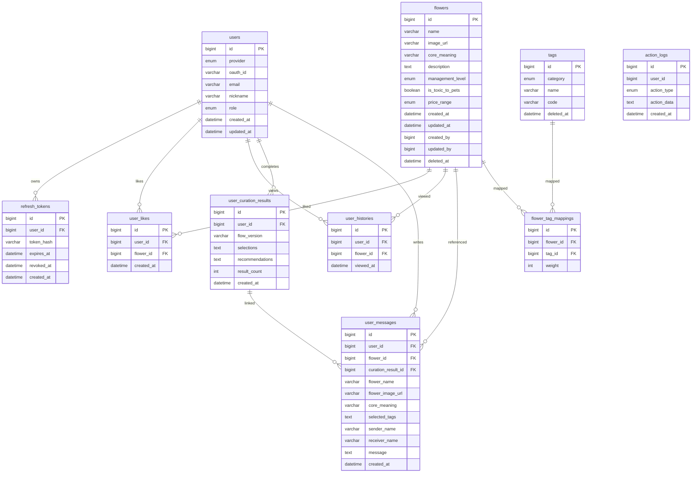

# Meanhwa 데이터베이스 스키마 설계서

이 문서는 현재 백엔드 코드에 구현된 JPA 엔티티 기준의 DB 스키마입니다. 운영 환경은 MySQL, 로컬/테스트 환경은 H2 MySQL 호환 모드를 사용합니다.

## 공통 정책

- PK는 `BIGINT` auto increment로 생성됩니다.
- Enum 값은 API/Java에서는 문자열로 다루고, 운영 MySQL schema에서는 Hibernate 6 validation에 맞춰 native `ENUM` 컬럼으로 저장됩니다.
- 시간 필드는 `DATETIME` 계열로 저장됩니다.
- 삭제 정책은 주요 콘텐츠 테이블에서 soft delete를 사용합니다.
- `action_logs.action_data`는 MySQL/H2 호환성을 위해 JSON 타입이 아니라 `TEXT`에 JSON 문자열로 저장합니다.

## Enum 값

### `management_level`

```text
EASY
NORMAL
HARD
```

### `price_range`

```text
LOW
MEDIUM
HIGH
PREMIUM
```

### `tag.category`

```text
EVENT
RELATION
EMOTION
MEANING
STYLE
CARE
SEASON
ENVIRONMENT
```

### `users.provider`

```text
DEV
KAKAO
NAVER
```

### `users.role`

```text
ROLE_USER
ROLE_ADMIN
```

### `action_logs.action_type`

```text
CURATION_START
CURATION_RESULT_CLICK
DICTIONARY_SEARCH
FLOWER_DETAIL_VIEW
ADMIN_USER_ROLE_CHANGE
```

## ERD



## 테이블 상세

## `flowers`

꽃/식물 마스터 테이블입니다. 공용 도감, 큐레이션, 메시지 생성, 관리자 CMS에서 사용됩니다.

| 컬럼 | 타입 | Null | 설명 |
| --- | --- | --- | --- |
| `id` | BIGINT | N | PK |
| `name` | VARCHAR(100) | N | 식물명 |
| `image_url` | VARCHAR(255) | Y | S3/CDN 이미지 URL |
| `core_meaning` | VARCHAR(100) | Y | 대표 꽃말 |
| `description` | TEXT | Y | 꽃/식물 자체 소개 및 특징 |
| `management_level` | ENUM | N | 관리 난이도 |
| `is_toxic_to_pets` | BOOLEAN | N | 반려동물 독성 여부 |
| `price_range` | ENUM | N | 예산대 |
| `created_at` | DATETIME | N | 생성 일시 |
| `updated_at` | DATETIME | N | 수정 일시 |
| `created_by` | BIGINT | Y | 생성 관리자 user id |
| `updated_by` | BIGINT | Y | 마지막 수정/삭제 관리자 user id |
| `deleted_at` | DATETIME | Y | soft delete 일시 |

현재 JPA 엔티티에는 `created_by`, `updated_by`에 DB FK 제약을 걸지 않았습니다. 관리자 추적용 id로 사용합니다.

## `tags`

큐레이션 조건 태그 테이블입니다.

| 컬럼 | 타입 | Null | 설명 |
| --- | --- | --- | --- |
| `id` | BIGINT | N | PK |
| `category` | ENUM | N | 태그 카테고리 (`EVENT`, `RELATION`, `EMOTION`, `MEANING`, `ENVIRONMENT`, …) |
| `name` | VARCHAR(50) | N | 태그명 |
| `code` | VARCHAR(80) | Y | 위저드·API 공통 식별자 (예: `BIRTHDAY`, `LOVE_3`). UNIQUE. 레거시(스타일·계절 등)는 NULL 가능 |
| `deleted_at` | DATETIME | Y | soft delete 일시 |

인덱스: `uk_tags_code` (`code`) — 현재 운영 DB는 Flyway migration(`src/main/resources/db/migration/mysql`) 기준으로 관리합니다.

중복 태그 검증은 서비스 계층에서 active tag 기준 `category + name` case-insensitive로 처리합니다.  
분기형 큐레이션 v2는 `code`로 `tagId`를 조회합니다 (`CurationCodeResolver`).

## `flower_tag_mappings`

꽃/식물과 태그의 추천 가중치 매핑 테이블입니다.

| 컬럼 | 타입 | Null | 설명 |
| --- | --- | --- | --- |
| `id` | BIGINT | N | PK |
| `flower_id` | BIGINT | N | `flowers.id` 참조 |
| `tag_id` | BIGINT | N | `tags.id` 참조 |
| `weight` | INT | N | 추천 가중치 |

인덱스:

| 이름 | 컬럼 | 설명 |
| --- | --- | --- |
| `idx_flower_tag` | `flower_id`, `tag_id` | 식물 기준 매핑 조회 |
| `idx_tag_flower` | `tag_id`, `flower_id` | 태그 기준 큐레이션 조회 |

관리자 API에서는 `weight`를 1~5로 검증합니다.

## `users`

서비스 회원 테이블입니다. 소셜 로그인 사용자를 저장합니다.

| 컬럼 | 타입 | Null | 설명 |
| --- | --- | --- | --- |
| `id` | BIGINT | N | PK |
| `provider` | ENUM | N | `DEV`, `KAKAO`, `NAVER` |
| `oauth_id` | VARCHAR(100) | N | provider 사용자 식별자 |
| `email` | VARCHAR(100) | Y | 이메일 |
| `nickname` | VARCHAR(50) | N | 닉네임 |
| `role` | ENUM | N | `ROLE_USER`, `ROLE_ADMIN` |
| `created_at` | DATETIME | N | 가입 일시 |
| `updated_at` | DATETIME | N | 마지막 프로필/권한 갱신 일시 |

제약:

| 이름 | 컬럼 | 설명 |
| --- | --- | --- |
| `uk_users_provider_oauth_id` | `provider`, `oauth_id` | 같은 provider 안에서 소셜 계정 중복 방지 |

운영에서 관리자 권한을 변경할 때는 가능하면 백오피스 API(`PUT /api/v1/admin/users/{userId}/role`)를 사용합니다. 최초 관리자 계정 bootstrap처럼 API를 호출할 수 없는 경우에만 DB를 직접 수정합니다.

예시:

```sql
UPDATE users
SET role = 'ROLE_ADMIN'
WHERE provider = 'NAVER'
  AND email = 'user@example.com';
```

## `refresh_tokens`

JWT refresh token 저장 테이블입니다. 원문 토큰은 저장하지 않고 SHA-256 hash만 저장합니다.

| 컬럼 | 타입 | Null | 설명 |
| --- | --- | --- | --- |
| `id` | BIGINT | N | PK |
| `user_id` | BIGINT | N | `users.id` 참조 |
| `token_hash` | VARCHAR(100) | N | refresh token hash |
| `expires_at` | DATETIME | N | 만료 일시 |
| `revoked_at` | DATETIME | Y | 폐기 일시 |
| `created_at` | DATETIME | N | 생성 일시 |

인덱스:

| 이름 | 컬럼 | 설명 |
| --- | --- | --- |
| `idx_refresh_token_hash` | `token_hash` unique | refresh token lookup |
| `idx_refresh_token_user` | `user_id` | 사용자별 토큰 조회/삭제 |

refresh API는 성공 시 토큰을 회전시키고 기존 refresh token을 폐기합니다.

## `user_likes`

사용자의 찜 목록 테이블입니다.

| 컬럼 | 타입 | Null | 설명 |
| --- | --- | --- | --- |
| `id` | BIGINT | N | PK |
| `user_id` | BIGINT | N | `users.id` 참조 |
| `flower_id` | BIGINT | N | `flowers.id` 참조 |
| `created_at` | DATETIME | Y | 찜 등록 일시 |

제약/인덱스:

| 이름 | 컬럼 | 설명 |
| --- | --- | --- |
| `uk_user_likes_user_flower` | `user_id`, `flower_id` | 같은 사용자의 중복 찜 방지 |
| `idx_user_likes_user_created` | `user_id`, `created_at` | 사용자 찜 목록 최신순 조회 |

## `user_histories`

사용자의 최근 본 식물 테이블입니다.

| 컬럼 | 타입 | Null | 설명 |
| --- | --- | --- | --- |
| `id` | BIGINT | N | PK |
| `user_id` | BIGINT | N | `users.id` 참조 |
| `flower_id` | BIGINT | N | `flowers.id` 참조 |
| `viewed_at` | DATETIME | N | 마지막 조회 일시 |

제약/인덱스:

| 이름 | 컬럼 | 설명 |
| --- | --- | --- |
| `uk_user_histories_user_flower` | `user_id`, `flower_id` | 같은 사용자의 같은 식물 히스토리 중복 방지 |
| `idx_user_histories_user_viewed` | `user_id`, `viewed_at` | 최근 본 식물 최신순 조회 |

서비스 정책:

- 꽃 상세 조회 시 인증 사용자의 이력을 기록합니다.
- 같은 식물을 다시 보면 row를 추가하지 않고 `viewed_at`을 갱신합니다.
- 사용자별 최근 본 식물은 최대 50개로 유지합니다.

## `user_curation_results`

로그인 사용자의 큐레이션 완료 결과 snapshot 테이블입니다.

| 컬럼 | 타입 | Null | 설명 |
| --- | --- | --- | --- |
| `id` | BIGINT | N | PK |
| `user_id` | BIGINT | N | `users.id` 참조 |
| `flow_version` | VARCHAR(50) | N | 큐레이션 플로우 버전 |
| `selections` | TEXT | N | 6단계 선택값 JSON snapshot |
| `recommendations` | TEXT | N | 추천 꽃 목록 JSON snapshot |
| `result_count` | INT | N | 완료 시점 전체 추천 결과 수 |
| `created_at` | DATETIME | N | 생성 일시 |

인덱스:

| 이름 | 컬럼 | 설명 |
| --- | --- | --- |
| `idx_user_curation_results_user_created` | `user_id`, `created_at` | 사용자별 큐레이션 결과 최신순 조회 |

## `user_messages`

로그인 사용자의 메시지 생성 이력 테이블입니다. 꽃/태그/큐레이션 표시값은 생성 시점 snapshot으로 저장합니다.

| 컬럼 | 타입 | Null | 설명 |
| --- | --- | --- | --- |
| `id` | BIGINT | N | PK |
| `user_id` | BIGINT | N | `users.id` 참조 |
| `flower_id` | BIGINT | N | `flowers.id` 참조 |
| `curation_result_id` | BIGINT | Y | 연결된 `user_curation_results.id` |
| `flower_name` | VARCHAR(100) | N | 생성 시점 꽃 이름 |
| `flower_image_url` | VARCHAR(255) | Y | 생성 시점 꽃 이미지 |
| `core_meaning` | VARCHAR(100) | Y | 생성 시점 대표 꽃말 |
| `selected_tags` | TEXT | N | 메시지 생성에 사용한 태그 JSON snapshot |
| `sender_name` | VARCHAR(50) | N | 보내는 사람 |
| `receiver_name` | VARCHAR(50) | N | 받는 사람 |
| `message` | TEXT | N | 생성된 메시지 본문 |
| `created_at` | DATETIME | N | 생성 일시 |

인덱스:

| 이름 | 컬럼 | 설명 |
| --- | --- | --- |
| `idx_user_messages_user_created` | `user_id`, `created_at` | 사용자별 메시지 최신순 조회 |
| `idx_user_messages_curation_result` | `curation_result_id` | 큐레이션 결과와 연결된 메시지 조회 |

## `action_logs`

사용자 행동 로그 테이블입니다. 큐레이션, 검색, 상세 조회, 추천 결과 클릭을 기록합니다.

| 컬럼 | 타입 | Null | 설명 |
| --- | --- | --- | --- |
| `id` | BIGINT | N | PK |
| `user_id` | BIGINT | Y | 인증 사용자의 `users.id`, 비회원은 null |
| `action_type` | ENUM | N | 행동 유형 |
| `action_data` | TEXT | N | JSON 문자열 payload |
| `created_at` | DATETIME | N | 로그 생성 일시 |

인덱스:

| 이름 | 컬럼 | 설명 |
| --- | --- | --- |
| `idx_action_logs_type_created` | `action_type`, `created_at` | 행동 유형별 기간 집계 |
| `idx_action_logs_user_created` | `user_id`, `created_at` | 사용자별 활동 조회/DAU 집계 |

로그 저장은 best-effort로 처리합니다. 로그 저장 실패가 사용자 API 실패로 전파되지 않도록 `ActionLogService` 내부에서 예외를 잡습니다.

## Seed 데이터

`src/main/resources/data.sql`은 테스트/local 초기 데이터를 제공합니다.

- `flowers`: 20종
- `tags`: 104개 (`code`가 있는 위저드 태그 포함)
- `flower_tag_mappings`: 기본 매핑 146개와 위저드 태그용 복제 매핑

테스트 프로필에서는 `spring.sql.init.mode=always`와 H2 in-memory DB를 사용해 seed 데이터가 매번 초기화됩니다.

## 운영 DB 주의사항

- 현재 prod profile은 `spring.jpa.hibernate.ddl-auto=${JPA_DDL_AUTO:validate}` 기본값을 사용합니다.
- 운영 schema 변경은 Flyway migration(`src/main/resources/db/migration/mysql/V*.sql`)으로 관리합니다.
- 기존 운영 DB처럼 이미 테이블이 있고 `flyway_schema_history`가 없는 DB는 최초 Flyway 편입 배포에서만 `FLYWAY_BASELINE_ON_MIGRATE=true`로 V1 baseline을 기록합니다. 이후 기본값은 false입니다.
- 신규 빈 DB는 V1 schema 이후 V2에서 큐레이션 위저드용 `tags.code` 참조 데이터를 생성합니다. 꽃 seed와 이미지 URL은 운영 CMS/S3 관리 대상입니다.
- 운영 데이터 직접 수정 시에는 조건을 provider/email/oauth_id 등으로 충분히 좁히고, `SELECT`로 대상 row를 확인한 뒤 `UPDATE`를 실행해야 합니다.
